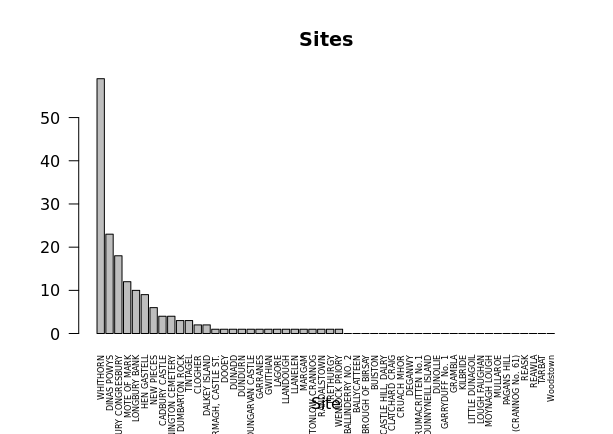
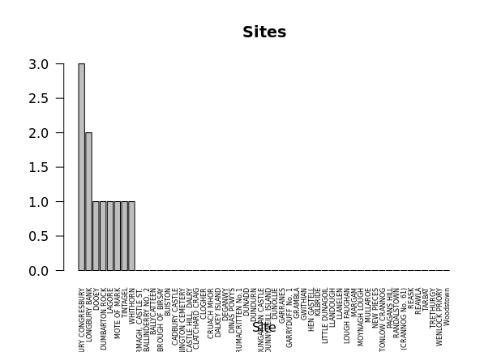
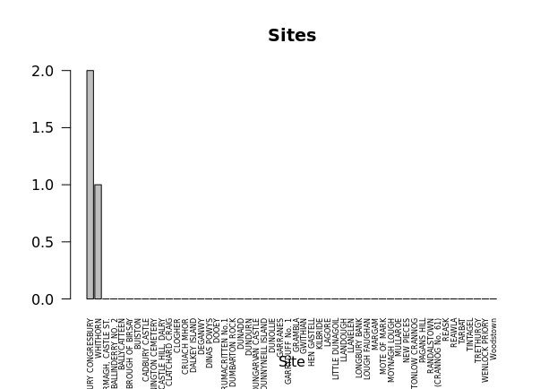
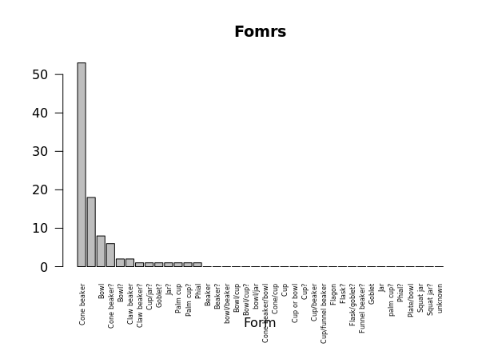
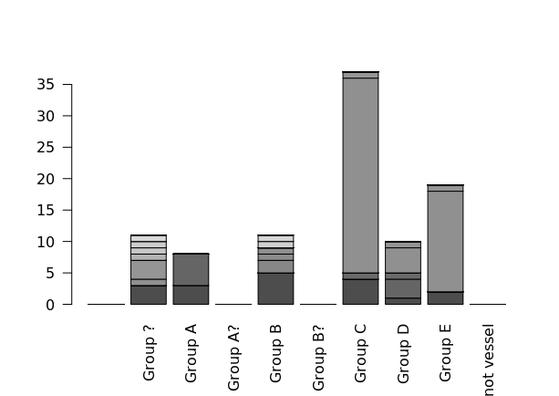
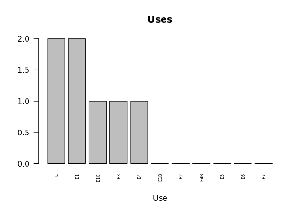
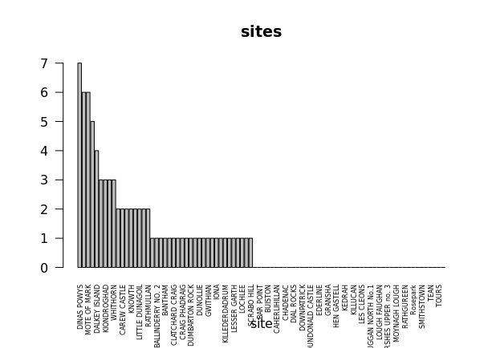

# Archaeology Data Services
Here are some photos of the graphs I tried to make using the code you provided:

This one was one of the words I tried because I saw it fairly often so I was curious to see if this was as common as Cone Beakers

This one was more for my own entertainment. Realistically there will be very few goblets since they are simply less practical than a cup

I didn't notice until later that there were some mistakes in the code, so that is why it says Fomrs instead of Forms (I corrected that later on with my own code)

## My Turn

After completing the preset activities I went to Archaeology Data Service to find a data set that I found interesting. 

New Spreadsheet Code: (I'm sorry the format isn't very nice, I was having issues with putting it in here, hope you can still read it easily)

Eware <- read.csv(curl("http://ads.ahds.ac.uk/catalogue/adsdata/arch-788-1/dissemination/csv/imports_database/Eware.csv"), header = TRUE, row.names = "ID" )

//

View(Eware)

//

Use <- Eware %>%

  filter(str_detect(Use, "no sooting"))
  
//

#Use version

siteCounts <- table(Use$site)

siteCounts <- sort(siteCounts, decreasing=TRUE)

barplot(siteCounts, main="sites", xlab="site", las=2, cex.names=.5 )

//

#this was the most common location for the vessals  

DinasPowys <- Use %>%

  filter(str_detect(site, "DINAS POWYS"))
  
//

View(DinasPowys)

//

DinasPowysCounts <- table(DinasPowys$Form)

DinasPowysCounts <- sort(DinasPowysCounts, decreasing=TRUE)

barplot(DinasPowysCounts, main="Uses", xlab="Use", las=2, cex.names=.5)

Here are the results of the code I tried to make in R:

